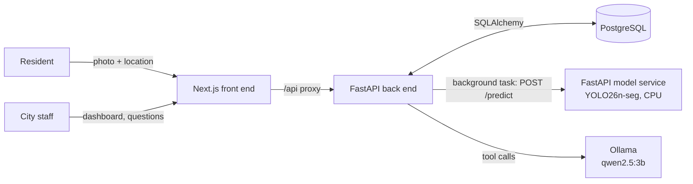

# RoadPulse

[](https://github.com/Anvitha8999/roadpulse/actions/workflows/ci.yml)

Residents photograph road damage and submit it with a location. A fine-tuned YOLO segmentation model outlines the cracks and assigns a 1–5 severity score. City staff see every report on a Next.js dashboard and can ask an LLM assistant questions like "What are the 3 most severe reports?", answered from live data through read-only tools.

Everything runs locally and for free: Docker Compose for development, and a kind Kubernetes cluster created by Terraform and deployed with Helm.


## How it works



1. **Upload.** The back end saves the photo, creates a `pending` report, and responds immediately.
2. **Score.** A background task sends the photo to the model service, which returns severity, damaged-area ratio, and model confidence. The report becomes `scored`. If the model service is down, the report is still saved and marked `failed`, and `POST /reports/{id}/score` retries it.
3. **Review.** The dashboard is server-rendered from the reports table and refreshes itself while anything is still scoring. Reports where the model is unsure are flagged **Needs review**.
4. **Ask.** The assistant can only call two read-only functions, `get_top_reports` and `get_report_stats`. It never writes SQL, and every answer shows which tools it used.

## The model

| | |
|---|---|
| Base model | YOLO26n-seg (Ultralytics), 2.7M parameters, 6.5 MB weights |
| Data | [Crack-Seg](https://docs.ultralytics.com/datasets/segment/crack-seg/): 3,717 train / 200 val / 112 test images, one `crack` class |
| Training | 20 epochs on a free Colab T4, about 29 minutes ([notebook](model-service/training/roadpulse.ipynb)) |
| **Test set, mask mAP50** | **0.628** (mAP50-95 0.221) |
| Test set, box mAP50 | 0.743 (mAP50-95 0.549) |
| CPU inference | roughly 100–200 ms per image on an M1 MacBook |

The test numbers come from the 112 held-out images that played no part in training or model selection. Validation mask mAP50 was higher (0.701) because the best epoch was chosen on that set.

**Severity is a transparent rule, not a learned output.** It is based on the fraction of the image covered by the union of the predicted masks (1 = no damage found, 5 = 3% or more of the image). It is unit-tested in CI and lives in [`severity.py`](model-service/app/severity.py).

**Needs review.** The confidence threshold is 0.10, chosen so that real-world cracks are not missed. Any detection whose highest confidence is below 0.30 is flagged for a person to check.

The weights are published as a [GitHub release](https://github.com/Anvitha8999/roadpulse/releases/tag/weights-v1) instead of being committed, and CI verifies them against [`best.pt.sha256`](model-service/weights/best.pt.sha256) before building.

## Run it

### Prerequisites

- Docker Desktop
- [Ollama](https://ollama.com) running on the host, with the model pulled: `ollama pull qwen2.5:3b`
- [uv](https://docs.astral.sh/uv/) (for the seed script)
- The model weights:

```bash
curl -fsSL -o model-service/weights/best.pt \
  https://github.com/Anvitha8999/roadpulse/releases/download/weights-v1/best.pt
shasum -a 256 -c model-service/weights/best.pt.sha256
cp .env.example .env
```

- Optional demo data (Crack-Seg test images, about 92 MB):

```bash
mkdir -p data && curl -L -o data/crack-seg.zip \
  https://github.com/ultralytics/assets/releases/download/v0.0.0/crack-seg.zip
unzip -q data/crack-seg.zip -d data/crack-seg
```

### Option A: Docker Compose

```bash
docker compose up --build -d --wait
uv run --project backend python backend/scripts/seed.py
```

Open http://localhost:3000. The API docs are at http://localhost:8000/docs.

### Option B: Kubernetes with kind, Helm, and Terraform

Requires [kind](https://kind.sigs.k8s.io/), kubectl, Helm, and Terraform.

```bash
docker build -t roadpulse-backend:0.2.0 backend
docker build -t roadpulse-model:0.2.0 model-service
docker build -t roadpulse-frontend:0.2.0 frontend

terraform -chdir=infra/terraform init
terraform -chdir=infra/terraform apply
```

One `apply` creates the cluster, loads the images, installs the Helm chart, and waits for every pod to pass its readiness probe. Open http://localhost:8080.

To seed, open a tunnel to the back end in one terminal and run the seed script in another:

```bash
kubectl port-forward svc/roadpulse-backend 8000:8000 -n roadpulse
uv run --project backend python backend/scripts/seed.py
```

Tear down with `terraform -chdir=infra/terraform destroy`.

## Continuous integration

Every push to `main` runs [GitHub Actions](.github/workflows/ci.yml):

| Job | Checks |
|---|---|
| Python services | `uv.lock` files match `pyproject.toml`, severity unit tests, back end imports cleanly |
| Front end | `npm ci`, ESLint, production build (includes the TypeScript type check) |
| Helm and Terraform | `helm lint`, `helm template`, `terraform fmt -check`, `terraform validate` |
| Docker images | Downloads and checksum-verifies the weights, builds all three images |

## Design decisions

- **Separate model service.** PyTorch is large and CPU-heavy. Keeping it out of the API keeps the back end image small (about 520 MB), lets the model scale on its own, and means a model crash cannot take down uploads.
- **Score after responding.** Uploads return in milliseconds and survive model outages. `BackgroundTasks` is the simplest version of this pattern; a production system would use a durable job queue.
- **CPU-only PyTorch on Linux.** The default PyTorch wheels for Linux include CUDA libraries. Pulling torch from PyTorch's CPU index cut the model image from 19.3 GB to 3.8 GB.
- **One origin for the browser.** A Next.js route proxies `/api/*` to the back end at runtime, so the API is never exposed directly and the same image works in Compose and Kubernetes.
- **Probes as a deployment gate.** The model has startup, readiness, and liveness probes; Terraform's Helm release waits for them before reporting success.
- **Read-only agent tools with a bounded loop.** The assistant gets at most four tool rounds, and tool errors are written as instructions to the model, so unsupported questions get a clear "that filter isn't available" instead of a loop or a made-up answer.

## Known limitations

- **The model detects cracks only, not potholes,** and it was trained on close-up crack images. On wide street-level photos it is less confident, and it produced a false positive on stone stairs at the same confidence as a real crack. That is why low-confidence results go to review. The next step would be fine-tuning on street-level data such as RDD2022, with hard negatives like stairs and tile joints.
- **Severity thresholds are not calibrated** against inspector labels; the dataset has none.
- **Local deployment only.** Images are loaded into kind directly rather than pushed to a registry, and CI builds images but does not deploy them.
- **One back end replica.** Uploaded photos live on a ReadWriteOnce volume. Scaling out would mean moving them to object storage such as S3 or MinIO.
- **No authentication, no database migrations** (tables are created at startup), and the Postgres password in `values.yaml` is a local development default.
- **The assistant cannot filter by street or date**, because neither tool supports it.

## Repository layout

```
backend/          FastAPI + SQLAlchemy API, background scoring, LLM agent, seed script
model-service/    FastAPI inference service, severity rule, tests, training notebook
frontend/         Next.js + TypeScript dashboard and resident upload page
deploy/           kind cluster config and the Helm chart
infra/terraform/  kind cluster + Helm release as code
.github/          CI workflow
```
